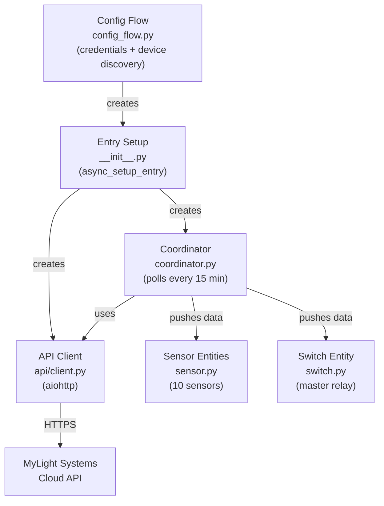

# Architecture

The integration follows the standard Home Assistant coordinator pattern:

**Data flow per update cycle:**
1. Coordinator calls `async_get_measures_grouping` (daily energy values) and `async_get_measures_total` (rates) sequentially
2. Optionally fetches battery state and relay state if devices are paired
3. Aggregated data is pushed to all sensor and switch entities
